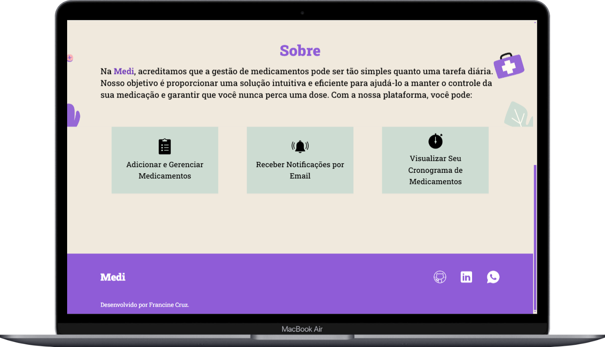
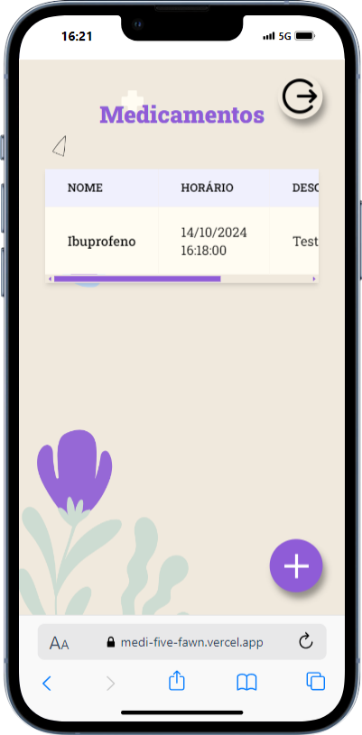

# Projeto de Lembrete de Medicamentos - Medi
Este projeto é uma aplicação Full Stack desenvolvida para auxiliar usuários a gerenciar e receber lembretes de medicamentos. A aplicação permite que os usuários cadastrem medicamentos e recebam notificações por e-mail no horário especificado.

## Tecnologias Utilizadas
### Frontend
+ React - Biblioteca para construção de interfaces de usuário.
+ Vite - Ferramenta de build rápida e otimizada para projetos frontend.
+ TailwindCSS - Framework de CSS utilitário para estilização rápida.
+ Axios - Biblioteca para requisições HTTP.
+ React Router Dom - Para gerenciamento de rotas.
+ ScrollReveal - Para animações e efeitos de rolagem.
+ Context API - Utilizada para gerenciamento de estado e controle de edição de medicamentos.
### Backend
+ Spring Boot - Framework para criação de APIs RESTful em Java.
+ Spring Security - Para autenticação e autorização.
+ Spring Data JPA - Para integração com bancos de dados.
+ PostgreSQL - Banco de dados relacional.
+ Java Mail (Spring Boot Starter Mail) - Para envio de e-mails.
+ JWT (Java JWT) - Para autenticação segura.
### Outros
+ Docker - Containerização para deploy no Render.
+ Render - Hospedagem do backend.
  
## Funcionalidades
+ Cadastro de Medicamentos: Os usuários podem registrar medicamentos, especificando o nome, detalhes do medicamento, horário e data de administração e email para receber lembretes.
+ Autenticação e Registro de Usuários: Autenticação segura utilizando JWT.
+ Envio de Lembretes por E-mail: O sistema verifica a cada 10 minutos se há medicamentos que precisam ser administrados e envia lembretes automáticos por e-mail.
+ Atualização e Exclusão de Medicamentos: Opções para modificar ou remover medicamentos já cadastrados.

## Observações
Para evitar problemas com o limite de requisições no Render, a verificação para envio de lembretes de medicamentos é realizada a cada 10 minutos. Isso ajuda a garantir que o sistema funcione de forma eficiente sem sobrecarregar o servidor, mas essa funcionalidade pode apresentar problemas ou até não funcionar.

## Contribuição
Contribuições são bem-vindas! Sinta-se à vontade para abrir issues e pull requests para melhorias ou correções.

## Licença
Este projeto é licenciado sob a MIT License.
